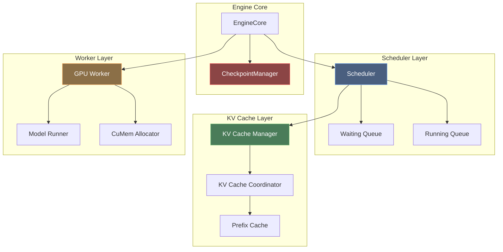
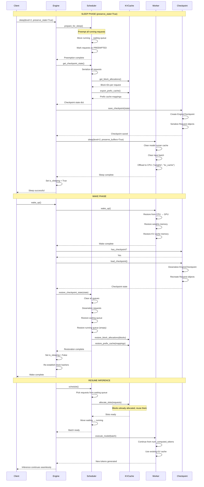
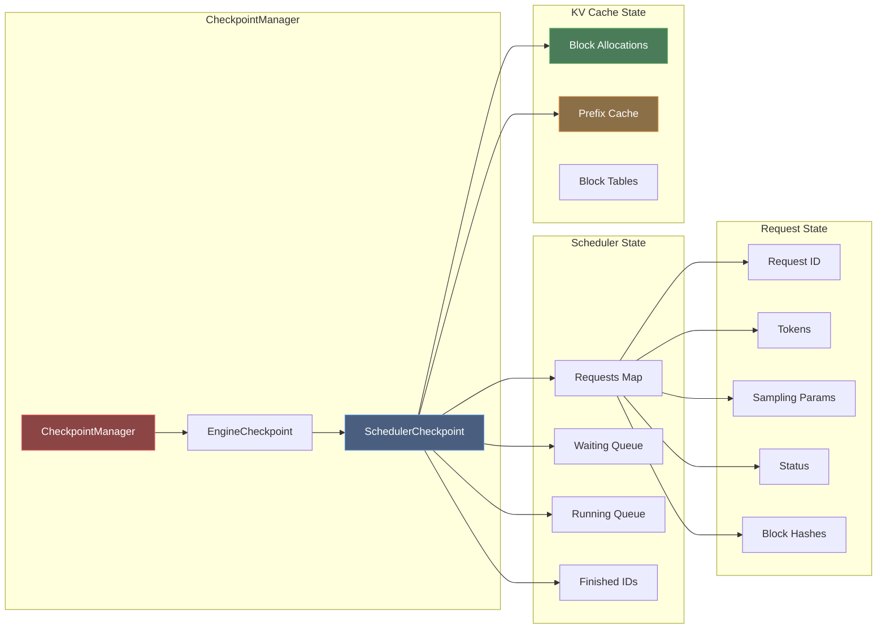
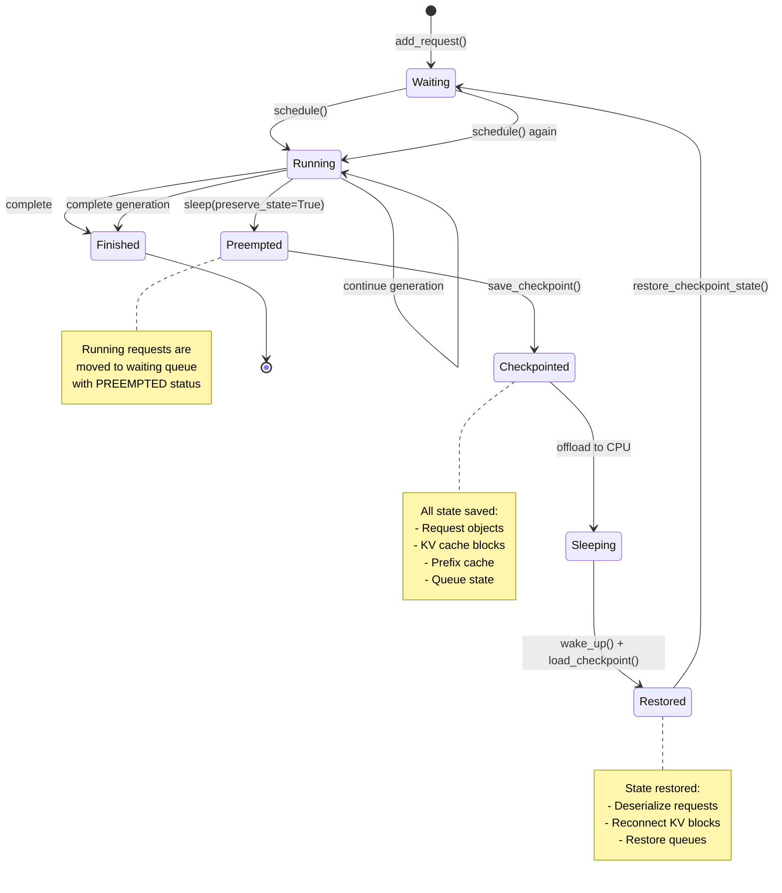
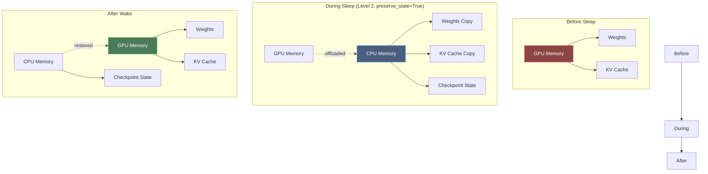
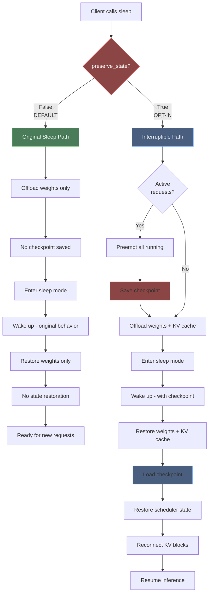
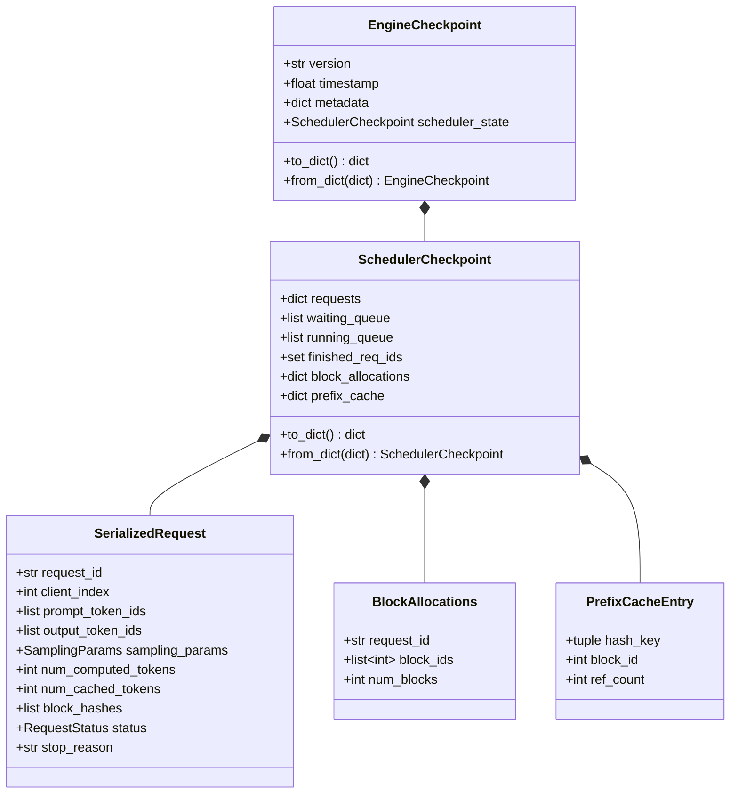
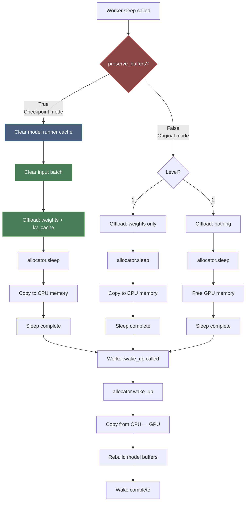
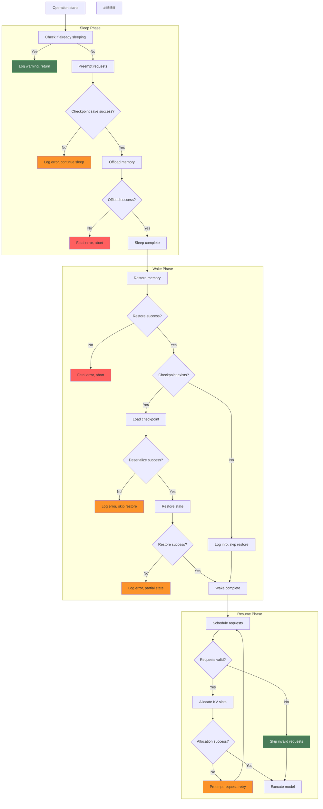

# Interruptible Inference Architecture Diagrams

## 1. Overall Architecture

## 2. State Preservation Flow (Sleep → Wake)

## 3. Component Interaction Detail

## 4. Request Lifecycle with Interruptible Inference

## 5. Memory Layout During Sleep/Wake

## 6. Decision Flow: preserve_state Parameter

## 7. Checkpoint Data Structure

## 8. Worker Sleep/Wake Flow

## 9. Error Handling and Edge Cases

## 10. Comparison: With vs Without preserve_state

```mermaid
graph TB
    subgraph "WITHOUT preserve_state (Original)"
        O1[Request active]
        O2[sleep called]
        O3[Offload weights]
        O4[Request lost]
        O5[wake_up called]
        O6[Restore weights]
        O7[Start fresh]

        O1 --> O2
        O2 --> O3
        O3 --> O4
        O4 --> O5
        O5 --> O6
        O6 --> O7
    end

    subgraph "WITH preserve_state=True (New)"
        N1[Request active]
        N2[sleep called]
        N3[Preempt request]
        N4[Save checkpoint]
        N5[Offload weights + KV]
        N6[wake_up called]
        N7[Restore weights + KV]
        N8[Load checkpoint]
        N9[Resume request]

        N1 --> N2
        N2 --> N3
        N3 --> N4
        N4 --> N5
        N5 --> N6
        N6 --> N7
        N7 --> N8
        N8 --> N9
    end

    style O4 fill:#ff6c6cff
    style N4 fill:#1cc91cff
    style N8 fill:#1cc91cff
    style N9 fill:#1cc91cff
```

## Summary

These diagrams illustrate the complete architecture and flow of the interruptible inference implementation:

1. **Architecture**: Shows the layered component structure
2. **Sequence**: Detailed sleep→wake→resume flow
3. **Component Interaction**: How checkpoint manager coordinates with scheduler and KV cache
4. **Request Lifecycle**: State transitions during sleep/wake
5. **Memory Layout**: GPU↔CPU memory movement
6. **Decision Flow**: How preserve_state parameter affects behavior
7. **Data Structure**: Checkpoint object relationships
8. **Worker Flow**: Low-level worker sleep/wake operations
9. **Error Handling**: Robust error management
10. **Comparison**: Old vs new behavior

The key insight is that **checkpoint-based state preservation** enables true interruptible inference while maintaining full backward compatibility through the opt-in `preserve_state` parameter.
